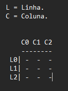

# Jogo_da_Velha
 Funcionalidades que quero implementar:

- Inicia o Jogo com um menu:
  - Start
  - Sair

- Tabuleiro deve ser exibido de forma que o entendimento de linhas e colunas fique facil:
  
  
Vetor de 5 Linhas e 4 Colunas

L0/C0 01 C2 C4
L1
L2
L3
L4